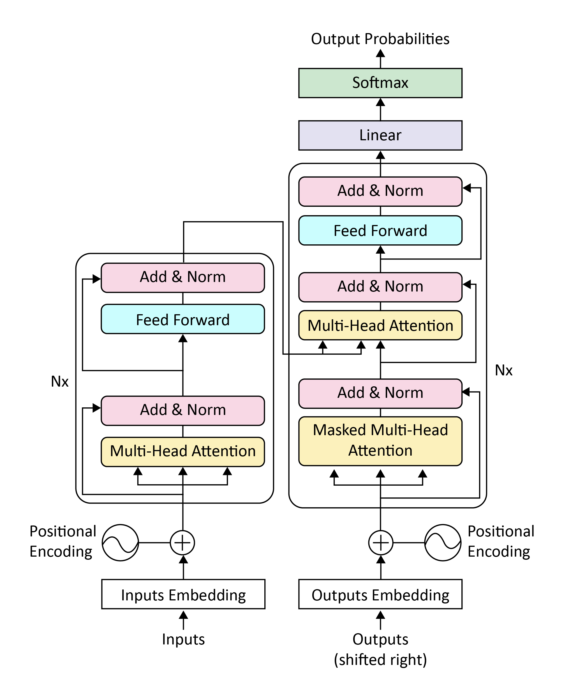
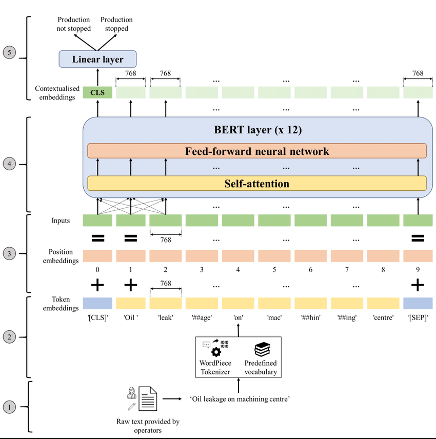
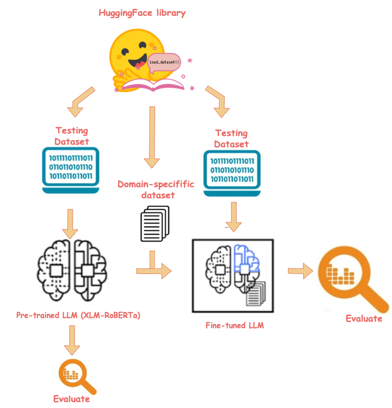

# Customer Support Ticket Intelligence using Fine-Tuned LLM

## 📌 Project Overview
This project aims to automate the classification of customer support tickets by fine-tuning a Large Language Model (LLM). The system analyzes incoming customer queries and categorizes them into specific **Issue Categories** and assigns a **Priority Level**. This helps in streamlining support operations, reducing response times, and ensuring critical issues are addressed promptly.

## 🎯 Objective
Fine-tune a pretrained language model to automatically classify customer support tickets into:
1.  **Issue Category**: Identifying the nature of the problem (e.g., Billing, Technical).
2.  **Priority**: Assigning a severity level (Low, Medium, High) to prioritize urgent requests.

## 📂 Dataset
The project uses the **[Banking77](https://huggingface.co/datasets/banking77)** dataset, which consists of online banking queries annotated with corresponding intents.
-   **Source**: Hugging Face Datasets
-   **Original Labels**: 77 granular intents
-   **Processed Labels**: Mapped to 5 high-level Business Categories for this project.

## 🏷️ Classification Schema

### Issue Categories
| Category | Description |
| :--- | :--- |
| **Billing** | Issues related to charges, fees, refunds, and payments. |
| **Account/Login** | Issues with password resets, account access, and blocking. |
| **Technical** | App crashes, features not working, or system errors. |
| **Order/Delivery** | Inquiries about card delivery, shipping status, and tracking. |
| **General Inquiry** | Other general questions or undefined issues. |

### Priority Levels
-   **High**: Urgent issues requiring immediate attention (e.g., security breaches, immediate financial loss).
-   **Medium**: Standard issues involving account maintenance or tracking.
-   **Low**: General questions or non-urgent requests.

## 🛠️ Project Structure
The project workflow creates the following directory structure:

```
├── data/
│   ├── raw/             # Raw CSV files converted from the dataset
│   └── processed/       # Preprocessed data ready for model training
├── notebooks/           # Jupyter/Colab notebooks containing the code
├── models/
│   ├── pretrained/      # Base models downloaded from Hugging Face
│   └── finetuned/       # Saved checkpoints of the fine-tuned model
├── results/
│   ├── metrics/         # Evaluation metrics and performance logs
│   └── plots/           # Visualizations of training progress
├── inference/
│   └── sample_outputs/  # Examples of model predictions
├── docs/                # Project documentation
└── logs/                # Training logs
```

## 🚀 Technologies Used
-   **Python**: Core programming language.
-   **Hugging Face Transformers**: For loading and fine-tuning LLMs.
-   **Hugging Face Datasets**: For accessing the Banking77 dataset.
-   **Pandas**: For data manipulation and analysis.
-   **Google Colab**: Primary development environment (leveraging GPU acceleration).

## ⚙️ Setup & Installation
1.  **Clone the repository** (if applicable) or download the notebook.
2.  **Install Dependencies**:
    The notebook uses the following libraries:
    ```bash
    pip install datasets transformers accelerate evaluate pandas
    ```
3.  **Run in Google Colab**:
    -   Upload the `.ipynb` file to Google Colab.
    -   Ensure GPU runtime is enabled (*Runtime > Change runtime type > T4 GPU*).
    -   Mount Google Drive when prompted to allow the script to save data and models vertically.

## 📈 Workflow
1.  **Phase 1: Project Setup**: Directory creation and environment configuration.
2.  **Phase 2: Data Collection**: Downloading the Banking77 dataset and inspecting samples.
3.  **Phase 3: Preprocessing**: Mapping the 77 specific intents to the 5 business categories and preparing the data for the model.
4.  **Phase 4: Tokenization & Model Loading**: Preparing text inputs for the LLM.
5.  **Phase 5: Fine-Tuning**: Training the model on the categorized data.
6.  **Phase 6: Evaluation**: Assessing model accuracy and generation capabilities.
7.  **Phase 7: Inference**: Testing the model on new, unseen customer queries.

## 📊 Results
*(Results will be populated effectively after training. Common metrics include Accuracy, F1-Score, and Confusion Matrices for classification performance.)*


